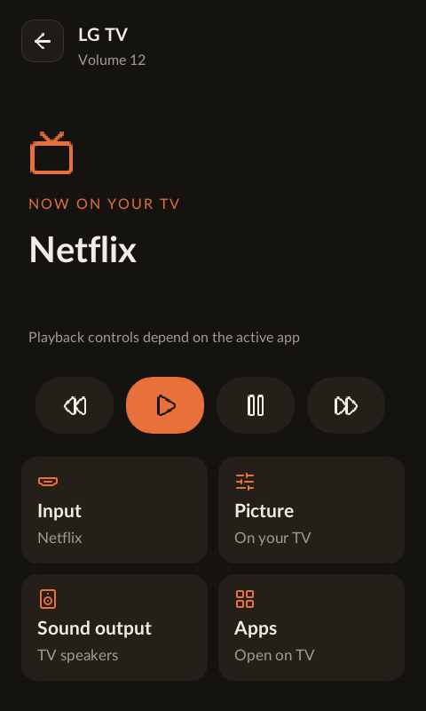

# LG webOS TV

Couch's Rust `couch-webos` client controls LG TVs over the SSAP WebSocket
protocol. The Rust/Wasm configuration UI uses the Rust daemon's authenticated
`/api/connections/{id}/webos` routes; credentials are never included in exported house config.

## Setup

Open **Connections → Add a connection → LG webOS TV**, name the connection,
and create it. Turn on the TV,
enter its IP address, click **Pair TV**, and approve the prompt on the TV.
If needed, enable LG Connect Apps/mobile-device control in the TV settings.
Pairing waits up to 60 seconds. Saved credentials can be checked and adopted
with **Test connection & save**, without prompting again.

Then open **Rooms & devices**, choose a room and the LG connection, and add
the TV. Connection settings and the room's TV card provide status, volume,
mute, input selection and app launch controls. Input/app buttons change the TV
only when clicked. Add a separately named connection for each TV. Pairings,
certificates, wake addresses and native control sessions are isolated by connection ID. Removing a connection
requires removing its room assignments first and retains credentials.

Encrypted `wss://IP:3001/` is the default. Explicit pairing trusts and pins
the TV's certificate. Normal connections require that same certificate.
The optional legacy checkbox uses unencrypted `ws://IP:3000/`; there is no
silent security downgrade. Credentials live at `/opt/couch/connections/<id>/webos-connection.json`
(mode 0600). Existing singleton credentials and wake settings migrate once; the
original files remain available for rollback. See [connection storage](connections.md).

## Client and validation

```sh
(cd clients && cargo test -p couch-webos)
couch-webos pair wss://192.168.1.176:3001/ /private/path/tv.json
couch-webos /private/path/tv.json status
couch-webos /private/path/tv.json watch
```

The library also supports playback, navigation buttons, subscriptions and
Wake-on-LAN. WOL needs a MAC address and network wake enabled on the TV.
Open the TV device in a room (or an activity with the LG TV as its source)
to enter the native Slint control screen:

| Control | Action |
| --- | --- |
| D-pad / OK | Navigate / select on the TV |
| Back | Back on the TV; stays in TV control mode |
| Volume + / − | TV volume up / down |
| Channel + / − | TV channel up / down (TV/app support required) |
| Menu | TV menu |
| Power | IR toggle by default; network off/wake only when selected in Connections |
| Home | TV Home |
| Mute | Toggle the TV's current mute state |
| Red / Green / Blue / Yellow | Matching TV color key |
| Return to Couch (touch) | Exit TV control mode |

The screen implements the selected Cinema (A) direction with a source/app hero,
icon-only play/pause/rewind/fast-forward, and touch input, app, picture and sound
cards. It slides in and out as a full-screen view. There are no touch duplicates
for physical navigation, power, home, mute, volume or color buttons. The touch
back arrow returns to Couch; physical Back always controls the TV.

Current input/app names come from this TV's input and app lists. The source and
sound output refresh every five seconds while idle. No movie artwork, title or
timeline is invented: linking a Kodi player explicitly to a TV input is still
needed for the rich linked-player version of the design. Play/pause and transport
commands depend on the active app/input. Sound choices include internal speakers
and HDMI ARC/eARC; rejection is displayed without assuming a successful change.
Picture-mode reads are optional; where direct modes are unavailable the card
explains using TV settings. A settings-app launch is offered only when the TV's
own app list includes it. No blind picture-mode or calibration writes are sent.

Volume status is
read after volume commands and every five seconds while idle. The native
controller owns persistent encrypted control/navigation sockets on a worker;
it does not block rendering. Its input queue is bounded, old queued keys
expire after 750ms, and leaving the screen invalidates queued commands and
late UI replies. An already-sent command cannot be recalled. Failed commands
are never automatically retried. Activity startup/shutdown steps use their configured device commands. With network power selected, connect once with
the TV on so Couch can learn its MAC from the local ARP table. The private
`webos-wake.json` binds that address to the current pairing URL. Power-on
sends Wake-on-LAN and checks for an active TV for up to 30 seconds; enable
network/mobile power-on in LG settings if it does not wake. Wake is not
reported as successful merely because the packet was sent.

The browser controls reconnect per operation. The library also supports
interleaved push subscriptions.

Validated against the physical TV at 192.168.1.176: encrypted pairing,
status, inputs, apps, subscriptions, and unchanged-volume command; the ARM
client also reads status from the remote. Browser checks cover adopting a
saved pairing and adding the TV to a room. Unit tests cover request/event
ordering, rejection, expired pairing, WOL packets, address validation and
configuration round trips. A physical-remote fixture verifies Slint input
through Rust SSAP/pointer sockets for D-pad, OK, Back, volume, channels and
exit. The physical GUI also raises and restores volume on the actual LG TV.
Navigation-socket establishment is verified on that TV;
physical power-off and network wake are also verified.

Protocol references: [Home Assistant's maintained SSAP client](https://github.com/home-assistant-libs/aiowebostv)
and [webOS integration setup](https://www.home-assistant.io/integrations/webostv/).

## HA100 physical key map

Captured on the physical remote on 2026-09-09 (all on `mt_gpio_kpd`):
Power **60**, Home **59**, Mute **113**, Red **66**, Green **67**, Blue **68**,
Yellow **87**. These differ from standard Linux color/power key codes. The
GUI reserves Slint F13–F18 for power, mute and colors; Home uses `Key.Home`.
These keys never auto-repeat, while volume and directional keys still do.
Physical-device fixture tests verify key-to-protocol mapping and mute toggle;
unit tests verify that holding a one-shot button does not generate repeats.
The actual LG TV passed physical mute-toggle and power-off/network-wake tests.

The TV and Kodi screens share the same touch back-button component. TV surfaces and text use the system theme, with the configured accent on controls; there is no fixed purple background tint. Activity button overrides are documented in [activity-buttons.md](activity-buttons.md).



## Per-TV power method and remaining IR prerequisites

**Connections → LG TV → Power control** selects IR (the default) or an explicit
Network alternative (WoL on, webOS off). The setting is bound to this pairing's
URL in private `webos-power.json`; changing to a different TV resets to IR.
Saving preferences sends no command. The screen reports whether `/dev/irtx`
exists, which is a prerequisite rather than proof of working IR output.

Supply verified power codes using the existing `couch-ir` codeset format:
`button protocol address command`. The physical button uses `power` (toggle).
Activity power-on and power-off use separate `power-on` and `power-off` entries.
No codes are prefilled; missing discrete codes never fall back to toggle. Both
routes send one frame with zero repeats, no retry and no automatic network
fallback. If the codes or blaster are unavailable, power reports an error; users
who need the existing network behavior must explicitly select Network.

Still required for hardware validation:
1. Enable/validate the HA100 MediaTek PWM IR driver and board resources. The current runtime
   has `CONFIG_MTK_PWM=y` and a bound PWM controller, but both IRTX options are
   disabled and `/dev/irtx` is absent. All kernel builds belong on **Ollie**.
2. Confirm carrier and actual LED transmission, then test with the TV in line of
   sight. Encoder and dispatch unit tests do not prove emitted light.
3. Validate the TV's codes. LG documents NEC address `0x04`, toggle `0x08`, and
   discrete on/off `0xC4`/`0xC5` as candidates. They are not compatibility proof
   for this particular B4 TV and are not automatically installed by Couch.

[LG IR code table](https://www.lg.com/us/support/products/documents/32LC50CB_Manual.pdf).

Validation covers default selection, missing-code rejection, prohibition of a
toggle fallback for discrete actions, malformed/duplicate code entries, private
per-endpoint persistence, API save without contacting a TV, and the dedicated
power path choosing IR before opening any network connection. No IR command was
sent during these checks; physical validation remains outstanding.
