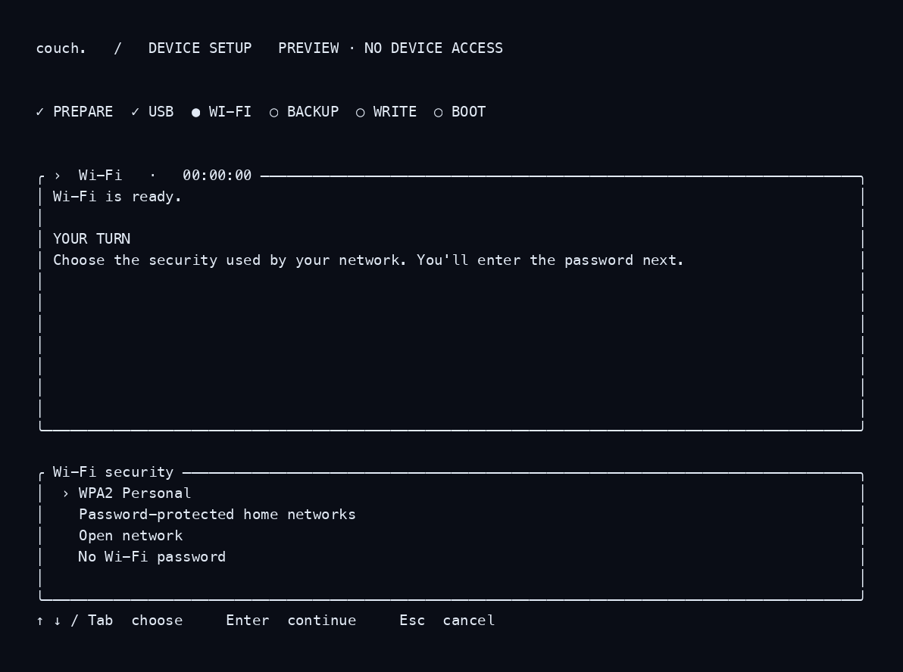

# Installer terminal interface

This independent Rust workspace builds the Ratatui terminal frontend. It does
not contain the installer backend, device payloads or host USB dependencies.

```sh
cargo run -- --demo
cargo run -- --snapshot
cargo test --locked
```

Both preview modes work without a device. Normal operation takes explicit
`--python`, `--backend`, and `--config` paths. The backend supplies structured
progress and input requests; Unix uses an inherited socket and Windows uses
private standard-input/output pipes. Pairing or Wi-Fi secrets are masked in the
terminal and must not be included in logs.

The build workflow produces Linux x64/ARM64, Windows x64 and macOS Intel/ARM
binaries, plus a universal macOS binary. Current Linux artifacts require glibc
2.39. macOS artifacts use ad-hoc signing. Windows backend IPC and cancellation
still need end-to-end validation; native UI tests are not USB installation tests.
A complete user-facing installer package and platform launcher are separate work.

`--native-backend /path/to/couch-installer-host` uses the same private event
channel directly, without a Python frontend process. It is exclusive of
`--python`/`--backend`. Unix inherits a dedicated socket; Windows uses private
pipes and the existing child-process job. The native host's full installation
entry point is still being integrated.

For a device-free IPC check, pass `--native-backend PATH --ui-smoke`. This asks
for a choice and masked fixture text, then exits without device access. CI runs
the real native child and checks both a completed exchange and cancellation on
Linux, macOS and Windows. This check is not an installation acceptance test.


